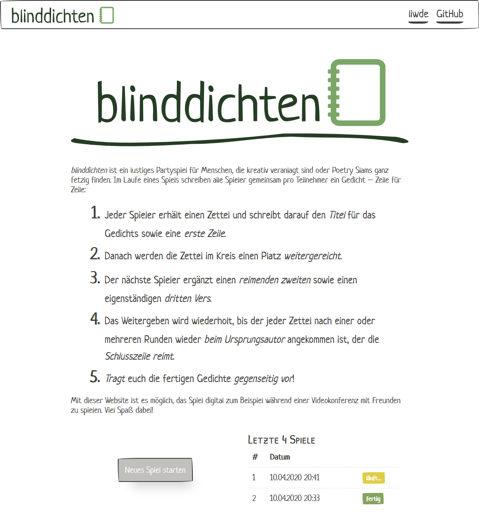
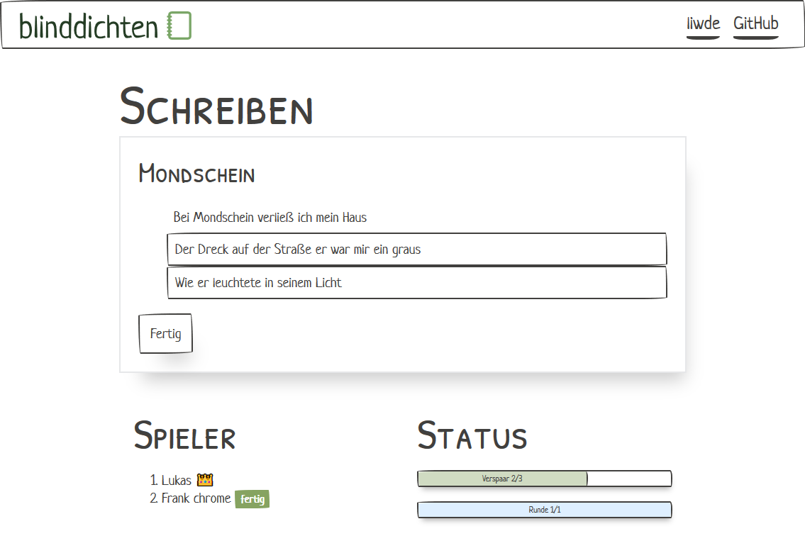

_blinddichten_ is a fun party game in which all players gather in a round to collectively write poems.

Each player gets a pen and a sheet of paper and writes down the title and a first verse. It's useful to decide on a common meter for the verses – iambic pentameter or tetrameter seem to work quite well. Then, each sheet is passed on to the next player, who adds a rhyming second verse, as well as a completely new third one. After that, the paper is folded so that only the title and the last verse are visible for the next player, who once again adds a rhyming verse and a new one. This is continued until the paper reaches the original author, who adds a final verse to finish off the poem. Finally, poems are read to each other in the most poetical manner.

## binddichten – the webapp

With this project, it is possible to play _blinddichten_ remotely, e.g. during a video call with friends. Digitize all the things! The project consists of two parts, communicating with each other via a well-defined set of messages.

### Backend

The backend is written in TypeScript. It is build around an abstraction for a WebSocket server to handle generic game events. The individual parts of the game (lobby, writing section, ...) that handle the actual game logic can subscribe to the generic as well as more specific `Actions` as send from the frontend clients there and use it to send out `Events` for the clients to react to.

The database is accessed through a simple API that can be implemented by different implementations for different databases. The InMemoryPersistence using objects within the JS runtime was the first one to be implemented and used to prototype and iterate the DB design.

- development: `npm run dev`
- build: `npm run build`

### Frontend

The frontend is a webapp written with [Svelte](https://svelte.dev/). There are `controls` to handle generic data display, and `screens` that control the whole UI layout, as well as a `Game` component handling anything inside a running game, `WebSocketHandler` abstraction over WebSockets and the `App` component bringing it all together.

The most beautiful UX is created by the awesome [PaperCSS](https://www.getpapercss.com/) library. The fonts used are [Neucha](https://fonts.google.com/specimen/Neucha) and [Patrich Hand SC](https://fonts.google.com/specimen/Patrick+Hand+SC). The logo is home-made, but the Android Icon was generated with [Android Asset Studio](https://romannurik.github.io/AndroidAssetStudio/icons-launcher.html).

- development: `npm run dev`
- build: `npm run build`

## TODOs

This project is hot off the press, the main building blocks developed in under a week. There are lots of things to do:

- **Add a real persistence in the backend.** MySQL should be supported to store the poems for a bit longer. Also, there should be put some more thought into regular cleanup of such database, especially for aborted rounds that were never finished.
- **Add non-essential features.** I'll list the ones I already have in mind:
  - a static page to view and print all poems
  - a "start new game" button on the Viewing screen -- one players clicks it, all players get a notification to join the new game
  - ~~a history of previous games at the Home screen, directly taking you to the static page with all the poems to enjoy them later, from the game ids stored in the browser's `localStorage`~~
- **Fix bugs.** I'll list some known ones:
  - ~~the player name will be stored in the browser's `localStorage` so it can be recovered on new games. Sometimes, it falls back to `undefined`, and I haven't found out when and why.~~

## Screenshots

